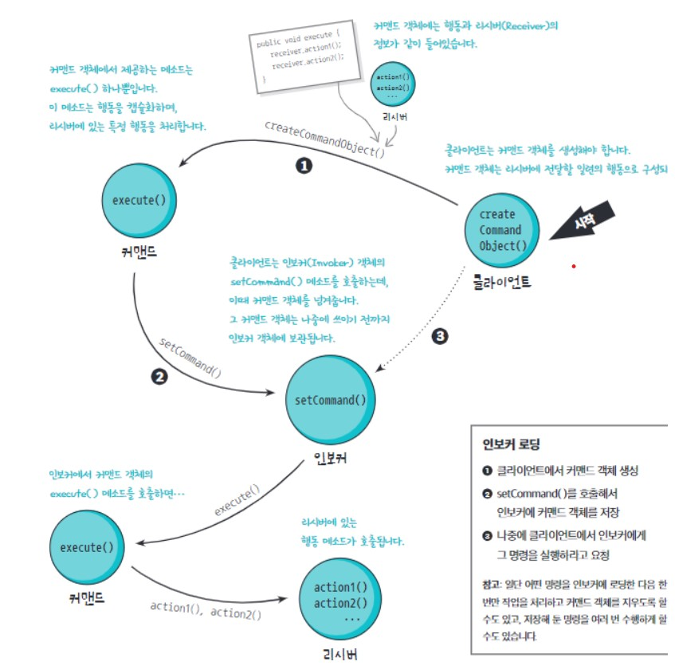
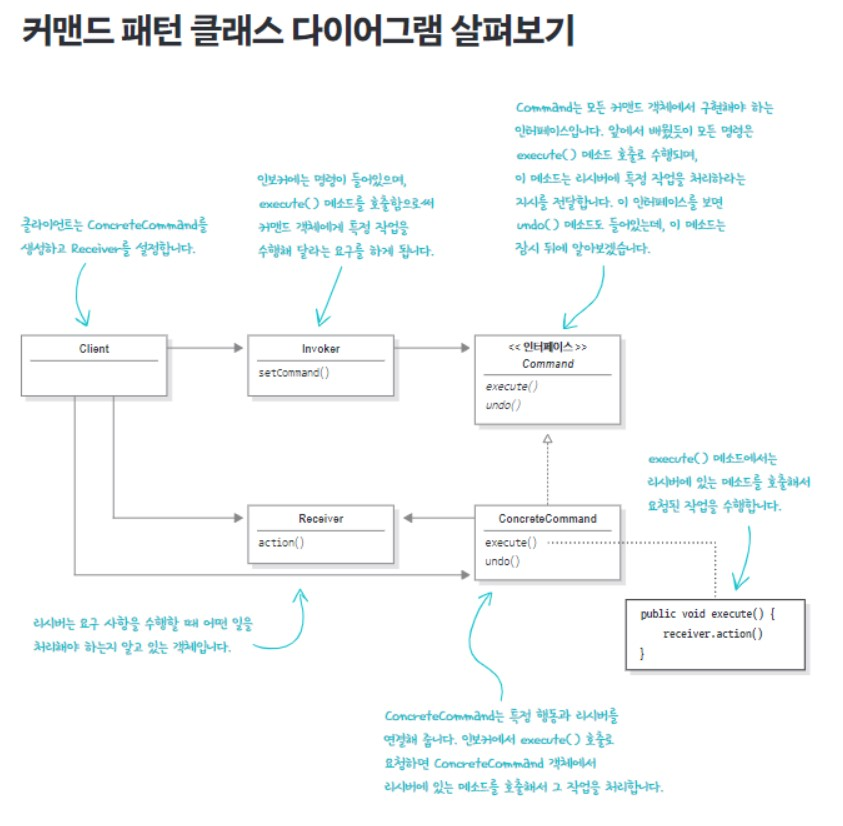

# 커맨드 패턴 : 호출 캡슐화하기
- 캡슐화 수준의 향상, 메소드 호출을 캡슐화해보자!
- 메소드 호출을 캡슐화하면 계산 과정의 각 부분을 결정화할 수 있기에 계산하는 코드를 호출한 객체는 그 일이 어떤 식으로 처리되는지 전혀 신경 쓸 필요가 없다.

### 만능 IOT 리모콘


### 협력 업체 클래스 살펴보기


- 다양한 기기를 제어해야한다. 어떤 기기의 인터페이스는 다른 기기와 꽤 많이 다르다.
    - 즉, 공통적인 인터페이스가 존재하지 않는다.
    - 더 큰 문제는 앞으로도 이런 클래스가 더 추가될 수 있다는 것이다.

### 커맨드 패턴 소개
- 음식 주문 과정으로 커맨드 패턴을 알아보자.

### 객체마을 식당과 커맨드 패턴


### 첫 번째 커맨드 객체 만들기
- 커맨드 인터페이스 구현
    - 커맨드 객체는 모두 같은 인터페이스를 구현해야한다. 그 인터페이스에는 메소드가 *하나*밖에 없다.
    - 주로 `execute()`라는 이름을 많이 쓴다.
```java
public interface Command{
    public void execute();
}
```
- 조명을 켤 때 필요한 커맨드 클래스 구현(ConcreteCommand)
```java
public class LightOnCommand implements Command {
	Light light;

	//set receiver
	public LightOnCommand(Light light) {
		this.light = light;
	}

	public void execute() {
		light.on();
	}
}
```

### 커맨드 객체 사용하기
- 슬롯과 버튼이 하나씩밖에 없는 리모콘에 커맨드 객체를 사용해봅시다.
```java
public class SimpleRemoteControl{
    Command slot; // 커맨드를 저장할 슬롯
    public SimpleRemoteControl(){}

    public void setCommand(Command command){ // 슬롯을 가지고 제어할 명령을 설정하는 메소드
        slot = command;
    }
    public void buttonWasPressed(){ // 버튼을 누르면 메소드 호출
        slot.execute();
    }
}
```

- 리모콘을 사용할 때 필요한 간단한 테스트 클래스
```java
public class RemoteControlTest{
    public static void main(String[] args){
        SimpleRemoteControl remote = new SimpleRemoteControl(); // 인보커 역할
        Light light = new Light(); // 리시버
        LightOnCommand lightOn = new LightOnCommand(light); // 커맨드 객체, 리시버 전달

        remote.setCommand(lightOn); // 커맨드 객체를 인보커에 전달
        remote.buttonWasPressed();
    }
}
```

### 커맨드 패턴의 정의
> **커맨드 패턴**(Command Pattern)을 사용하면 요청 내역을 객체로 캡슐화해서 객체를 서로 다른 요청 내역에 따라 매개변수화할 수 있다. 이러한 요청을 큐에 저장하거나 로그로 기록하거나 작업 취소 기능을 사용할 수 있다.
- 커맨드안에 리시버가 들어감으로서 캡슐화된 요청을 완성할 수 있다.


### 버튼이 여러 개, 취소 기능이 있는 만능 리모콘
- 리모콘 코드
```java
public class RemoteControl {

	Command[] onCommands;
	Command[] offCommands;
	Command undoCommand;

	public RemoteControl() {
		onCommands = new Command[7];
		offCommands = new Command[7];

		Command noCommand = new NoCommand(); // 아무 동작도 없는 커맨드 객체 일종의 Null 객체

		for (int i = 0; i < 7; i++) {
			onCommands[i] = noCommand;
			offCommands[i] = noCommand;
		}
		undoCommand = noCommand;

	}

	public void setCommand(int slot, Command onCommand, Command offCommand) {
		onCommands[slot] = onCommand;
		offCommands[slot] = offCommand;

	}

	public void onButtonWasPushed(int slot) {
		onCommands[slot].execute();
		undoCommand = onCommands[slot];

	}

	public void offButtonWasPushed(int slot) {
		offCommands[slot].execute();
		undoCommand = offCommands[slot];

	}

	@Override
	public String toString() {
		StringBuffer sb = new StringBuffer();

		for (int i = 0; i < 7; i++) {
			sb.append(onCommands[i].getClass().getName() + " / " + offCommands[i].getClass().getName() + "\n");
		}
		return sb.toString();

	}

}
```

- **람다식을 써서 고친 코드**
```java
public class RemoteLoader{
	public static void main(String args[]){
		RemoteControl remoteControl = new RemoteControl();
		Light livingRoomLight = new Light("Living Room");

		...
		/*
		LightOnCommand livingRoomLightOn~~
				= new LightOnCommand(livingRoomLight);
		LightOffCommand livingRoomLightOff~~
				= new LightOffCommand(livingRoomLight);
		*/

		
		remoteControl.setCommand(0, () -> livingRoomLight.on(),
									() -> livingRoomLight.off());
	}
}
```

### NoCommand 클래스
```java
public class NoCommand implements Command(){
	public void excute(){}
}
```
> **NoCommand객체** : NoCommand객체는 일정의 널 객체(null object)이다. 널 객체는 딱히 리턴할 객체도 없고 클라이언트가 null을 처리하지 않게 하고 싶을 때 활용하면 좋다. 널 객체는 여러 디자인 패턴에서 유용하게 쓰인다. 그래서 널 객체를 일종이 디자인 패턴으로 분류하기도 한다.

### 매크로 커맨드
- 매크로 커맨드는 여러 개의 커맨드를 한 데 묶어놓은 커맨드이다.
```java
public class MacroCommand implements Command {

	Command[] commands;

	public MacroCommand(Command[] commands) {
		this.commands = commands;
	}

	public void execute() {
		for (int o = 0; i < commands.length; i++) {
			commands[i].execute();
		}
	}

	public void undo() {
		for (int o = 0; i < commands.length; i++) {
			commands[i].undo();
		}
	}
}
```
```java
Command[] macroOn = {lightOn, stereoOn, tvOn };
Command[] macroOff = {lightOff, stereoOff, tvOff };

Macrocommand commandMacroOn = new MacroCommand(macroOn);
Macrocommand commandMacroOff = new MacroCommand(macroOff);

remoteControl.setCommand(0, commandMacroOn, commandMacroOff);
```

### 핵심 정리
- 커맨드 패턴을 사용하면 요청하는 객체와 요청을 수행하는 객체를 분리할 수 있다.
- 이렇게 분리하는 과정의 중심에는 커맨드 객체가 있으며, 이 객체가 행동이 들어있는 리시버를 캡슐화한다.
- 인보커는 무언가 요청할 때 커맨드 객체의 `execute()`메소드를 호출하면 된다.  
`execute()`메소드는 리시버에 있는 행동을 호출한다.
- 커맨드는 인보커를 매개변수화 할 수 있다. 실행 중에 동적으로 매개변수화를 설정할 수도 있다.
- `execute()`메소드가 마지막으로 호출되기 전의 상태로 되돌리는 작업 취소 메소드를 구현하면 커맨드 패턴으로 작업 취소 기능을 구현할 수 도 있다.
- 매크로 커맨드는 커맨드를 확장해서 여러 개의 커맨드를 한 번에 호출할 수 있게 해주는 가장 간편한 방법이다. 매크로 커맨드로도 어렵지 않게 작업 취소 기능을 구현할 수 있다.
- 프로그래밍을 하다 보면 요청을 스스로 처리하는 '스마트'커맨드 객체를 사용하는 경우도 종종 있다.
- 커맨드 패턴을 활용해서 로그 및 트랜잭션 시스템을 구현할 수 있다.
